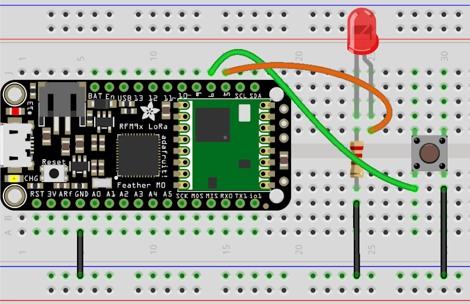

# Build a Node

Let's build a circuit to connect to the network. You can send a message by pressing the button. Received messages should light up the LED.

## Web console
In your browser, open: **steamlink.local** to see your node
